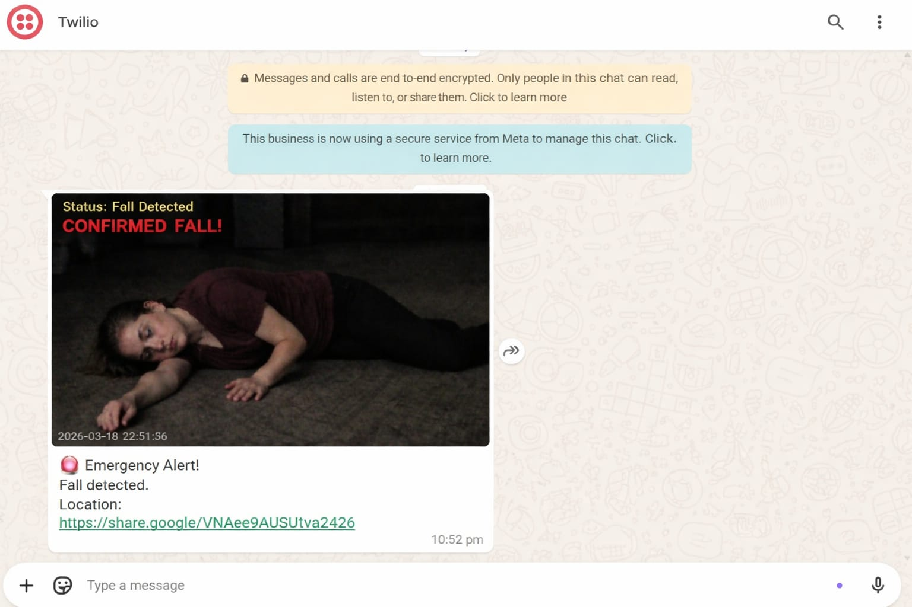

# Smart Vision-Based Real-Time Fall Detection System

## Overview

This project detects human falls in real-time using computer vision techniques. It sends emergency alerts via SMS, WhatsApp, and phone calls.

## Tech Stack

* Python
* OpenCV
* YOLO
* Twilio
* Ngrok

## /Features

* Real-time fall detection
* Instant alert system (SMS / Call / WhatsApp)
* Captures image during emergency

## Output

  
  

## How to Run

1. Install required libraries
2. Run the Python file
3. Start camera for detection

## Dataset

Dataset is not included. You can use your own dataset or any open-source fall detection dataset.

## Author

S. Harshitha
